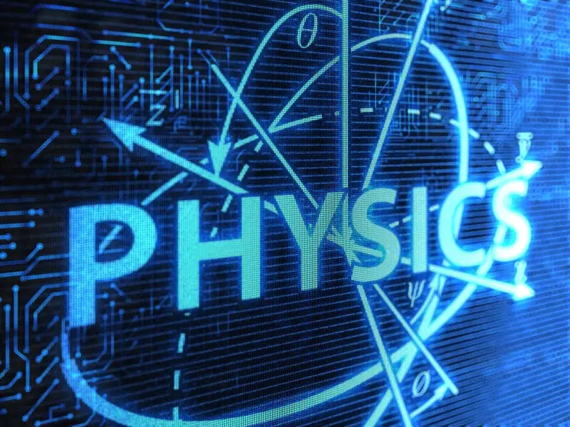
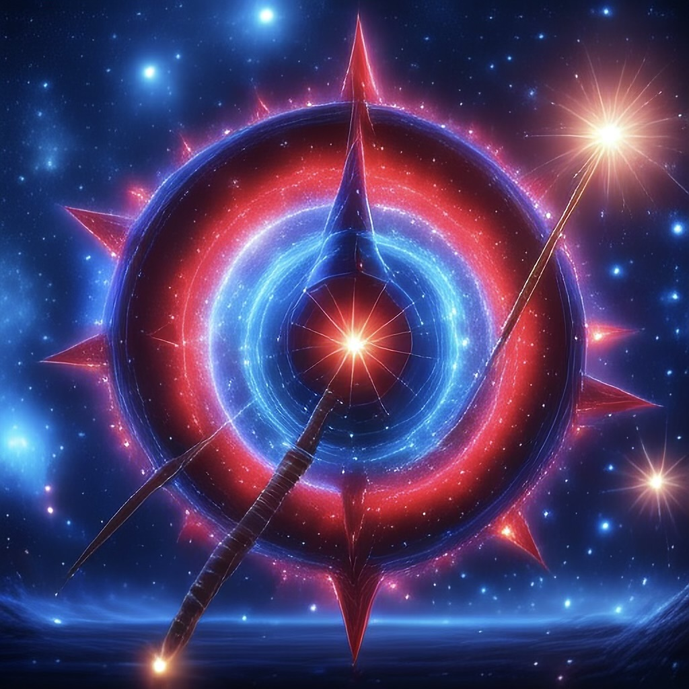

<div align="center">
   
   <h1>Universal Physics Hub</h1>
   <h3><em>Interactive physics simulations with clear, exam‑ready theory.</em></h3>
   <p>
      
      
      
      
   </p>
</div>

## About

Universal Physics Hub is a curated set of interactive physics simulations built with React + p5.js. Each chapter pairs a lightweight canvas experiment with concise theory blocks: formulas, notes, examples, and quick labs. It aims to make concepts feel tangible without sacrificing correctness, suitable for school learners and curious adults alike.

Highlights
- 30+ simulations across mechanics, rotation, waves, optics, electricity & magnetism, and thermal physics
- Clean UI with consistent controls and responsive layout
- Theory that maps to popular syllabi (CBSE/ISC/IGCSE style)
- Data‑driven content; easy to add new chapters (`src/data/chapters.js`)

## Link

Clone the project locally or try the web app on the original site: https://morningstarxcdcode.github.io/Universal-Physics-Hub/

## Steps to run it locally

1. Clone the repository to your computer <br>
   ``` bash
   git clone https://github.com/morningstarxcdcode/Universal-Physics-Hub.git
2. Navigate to the app directory <br>
   ``` bash
   cd Universal-Physics-Hub
3. Install the necessary dependencies <br>
   ```bash
    npm install
    # or
    yarn install
    ```
6. Start the local development server <br>
   ```bash
   npm run dev
7. Open your browser to http://localhost:3000 or http://localhost:5173/

<br>
<hr>

### Contributors

<table>
   <tr>
      <td align="center">
         
         <br />
         <a href="https://github.com/morningstarxcdcode">morningstarxcdcode</a>
      </td>
      <td align="center">
         
         <br />
         <span>Community Contributors</span>
      </td>
   </tr>
</table>


### Supporters

<table>
   <tr>
      <td align="center">
         
         <br />
         <a href="https://github.com/MStarRobotics">Robotics</a>
      </td>
      <td align="center">
         
         <br />
         <span>Supporters</span>
      </td>
   </tr>
</table>

<!-- Community/Discord section removed as requested -->

### Syllabus mapping (quick index)

- Class 10: Light (Reflection & Refraction), Human Eye & Colourful World, Electricity, Magnetic Effects of Current, Sources of Energy
- Class 11: Units & Measurements; Motion in a Straight Line/Plane; Laws of Motion; Work–Energy–Power; System of Particles & Rotation; Gravitation; Properties of Bulk Matter; Thermodynamics; Kinetic Theory; Oscillations; Waves
- Class 12: Electrostatics; Current Electricity; Magnetic Effects of Current & Magnetism; Electromagnetic Induction & AC; Electromagnetic Waves; Optics (Ray/Wave); Dual Nature; Atoms & Nuclei; Electronic Devices

See `src/data/chapters.js` for implemented topics and open an issue for the rest.

### Performance

Route‑level code splitting (React.lazy + Suspense) reduces initial bundle size. Rollup may still warn about large chunks depending on what’s preloaded—informational only. Further tuning can split rarely used utilities into separate chunks.


### License

