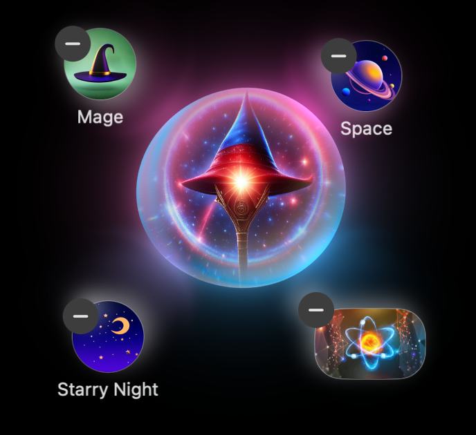

# Universal Physics Hub

Interactive physics simulations with clear, exam‑ready theory.




[](https://github.com/morningstarxcdcode/Universal-Physics-Hub/actions/workflows/gh-pages.yml)
[](https://morningstarxcdcode.github.io/Universal-Physics-Hub/)


## About

Universal Physics Hub is a curated set of interactive physics simulations built with React + p5.js. Each chapter pairs a lightweight canvas experiment with concise theory blocks: formulas, notes, examples, and quick labs. It aims to make concepts feel tangible without sacrificing correctness, suitable for school learners and curious adults alike.

Highlights

- 30+ simulations across mechanics, rotation, waves, optics, electricity & magnetism, and thermal physics
- Clean UI with consistent controls and responsive layout
- Theory that maps to popular syllabi (CBSE/ISC/IGCSE style)
- Data‑driven content; easy to add new chapters (`src/data/chapters.js`)

## Link

Clone the project locally or try the web app on the original site: <https://morningstarxcdcode.github.io/Universal-Physics-Hub/>

## Steps to run it locally

1. Clone the repository to your computer

   ```bash
   git clone https://github.com/morningstarxcdcode/Universal-Physics-Hub.git
   ```

2. Navigate to the app directory

   ```bash
   cd Universal-Physics-Hub
   ```

3. Install the necessary dependencies

   ```bash
   npm install
   # or
   yarn install
   ```

4. Start the local development server

   ```bash
   npm run dev
   ```

5. Open your browser to <http://localhost:5174/>

---

**6. Temporary Sharing (while running locally):**

If you don’t want to deploy yet, you can easily tunnel your localhost so others can access your running app:

- Install ngrok (free):

    ```bash
    brew install ngrok/ngrok/ngrok
    ```

- Start ngrok to tunnel your dev server (default Vite port is 5174):

    ```bash
    ngrok http 5174
    ```

- ngrok will provide you with a link like:

    ```text
    https://randomstring.ngrok.io
    ```

- Share this link with others; they can open your local server temporarily in their browsers.


---

### Contributors

| Contributor | Preview |
| --- | --- |
| [@morningstarxcdcode](https://github.com/morningstarxcdcode) |  |


### Supporters

| Supporter | Preview |
| --- | --- |
| [Robotics](https://github.com/MStarRobotics) |  |

<!-- Community/Discord section removed as requested -->

### Syllabus mapping (quick index)

- Class 10: Light (Reflection & Refraction), Human Eye & Colourful World, Electricity, Magnetic Effects of Current, Sources of Energy
- Class 11: Units & Measurements; Motion in a Straight Line/Plane; Laws of Motion; Work–Energy–Power; System of Particles & Rotation; Gravitation; Properties of Bulk Matter; Thermodynamics; Kinetic Theory; Oscillations; Waves
- Class 12: Electrostatics; Current Electricity; Magnetic Effects of Current & Magnetism; Electromagnetic Induction & AC; Electromagnetic Waves; Optics (Ray/Wave); Dual Nature; Atoms & Nuclei; Electronic Devices

See `src/data/chapters.js` for implemented topics and open an issue for the rest.

### Performance

Route‑level code splitting (React.lazy + Suspense) reduces initial bundle size. Rollup may still warn about large chunks depending on what’s preloaded—informational only. Further tuning can split rarely used utilities into separate chunks.


### License


